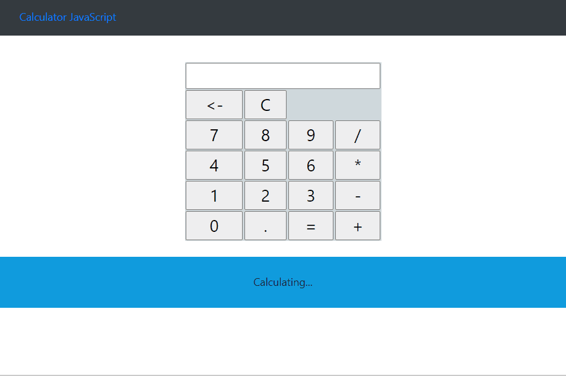
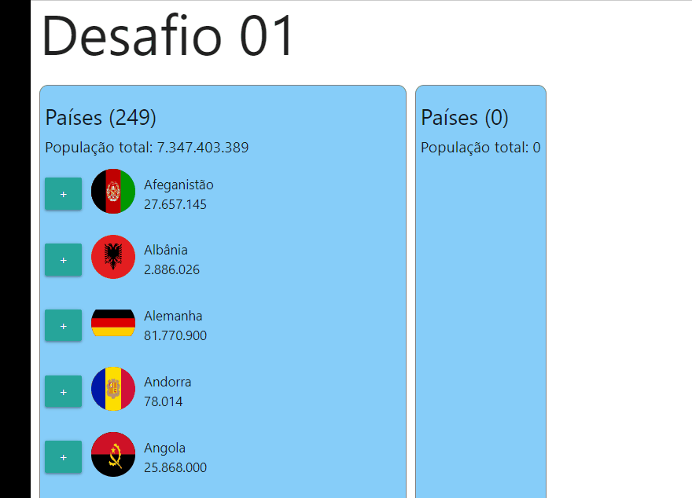
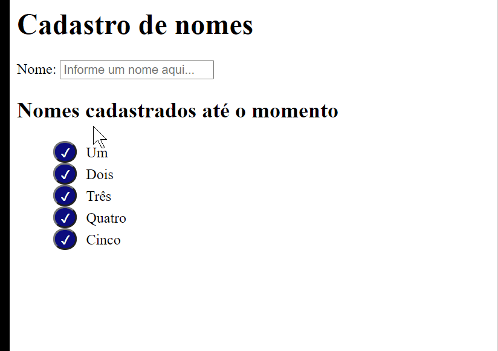

##   igti-bootcamp-frontend 2020©: :checkered_flag:

---

**Repositório para armazenar conteúdos do Bootcamp Desenvolvedor Frontend da IGTI.** :octocat: 

     

---

## Over view das aplicações
---

---

---

---

## **Fundamentos em Desenvolvimento Front End - FFE203A ©**

     

 ### Módulos: 
 

 **Capítulo 1 - Ecossistema:**
  - Material das videoaulas do capítulo 1

     > Aula 1.1.1 - Introdução ao Visual Studio Code (Parte 1)
     
     > Aula 1.1.2 - Introdução ao Visual Studio Code (Parte2)
     
     > Aula 1.2 - Introdução ao Node.js
     
     > Aula 1.3 - Introdução ao NPM e à biblioteca live-server
     
     > Aula 1.4.1 - Noções de HTML (Parte 1)
     
     > Aula 1.4.2 - Noções de HTML (Parte 2)
     
     > Aula 1.5.1 - Noções de CSS (Parte 1)
     
     > Aula 1.5.2 - Noções de CSS (Parte 2)

 - Exercícios de fixação do capítulo 1

---
 **Capítulo 2 - JavaScript**

- Material das videoaulas do capítulo 2
   > Aula 2.1 - Introdução ao JavaScript
   
   > Aula 2.2.1 - JavaScript básico (Parte 1)
   
   > Aula 2.2.2 - JavaScript básico (Parte 2)
   
   > Aula 2.3.1 - JavaScript – Comandos de bloco (Parte 1)
   
   > Aula 2.3.2 - JavaScript – Comandos de bloco (Parte 2)
   
   > Aula 2.3.3 - JavaScript – Comandos de bloco (Parte 3)
   

- Exercícios de fixação do capítulo 2

---

**Capítulo 3 - DOM, Formulários e Eventos**
 
- Material das videoaulas do capítulo 3
  > Aula 3.1 - Manipulando o DOM com JavaScript
  
  > Aula 3.2 - Manipulando o CSS com JavaScript
  
  > Aula 3.3 - Formulários HTML
  
  > Aula 3.4 - JavaScript – Manipulação de eventos
  
  > Aula 3.5.1 - JavaScript – CRUD com HTML/CSS/JavaScript (Parte 1)
  
  > Aula 3.5.2 - JavaScript – CRUD com HTML/CSS/JavaScript (Parte 2)
  
  > Aula 3.5.3 - JavaScript – CRUD com HTML/CSS/JavaScript (Parte 3)
  
  > Aula 3.5.4 - JavaScript – CRUD com HTML/CSS/JavaScript (Parte 4)

- Exercícios de fixação do capítulo 3

- Fórum Pontuado

- Primeira Aula Interativa

- Trabalho Prático - Atividade Prévia
  
---

**Capítulo 4 - JavaScript Moderno**

- Material das videoaulas do capítulo 4

  > Aula 4.1.1 - Introdução ao JavaScript moderno (Parte 1)
  
  > Aula 4.1.2 - Introdução ao JavaScript moderno (Parte 2)
  
  > Aula 4.2.1 - Manipulação de arrays com ES6+ (Parte 1)
  
  > Aula 4.2.2 - Manipulação de arrays com ES6+ (Parte 2)
  
  > Aula 4.2.3 - Manipulação de arrays com ES6+ (Parte 3)
  
  > Aula 4.3 - Operador ... e destructuring
  
  > Aula 4.4 - Refatorando o projeto do Capítulo 3
  
- Exercícios de fixação do capítulo 4

---

**Capítulo 5 - Programação Assíncrona com JavaScript**

- Material das videoaulas do capítulo 5

  > Aula 5.1 - Introdução à programação assíncrona com JavaScript
  
  > Aula 5.2 - As funções setTimeout e setInterval
  
  > Aula 5.3.1 - Requisições HTTP com JavaScript (Parte 1)
  
  > Aula 5.3.2 - Requisições HTTP com JavaScript (Parte 2)
  
  > Aula 5.4.1 - Desafios Finais (Parte 1)
  
  > Aula 5.4.2 - Desafios Finais (Parte 2)
  
  > Aula 5.4.3 - Desafios Finais (Parte 3)
  
  > Aula 5.4.4 - Desafios Finais (Parte 4)
  
  > Aula 5.4.5 - Desafios Finais (Parte 5)
  
- Exercícios de fixação do capítulo 5

- Segunda aula interativa

- Trabalho Prático
  
  ---

**Avaliação final: 99.34%** :trophy:
---

